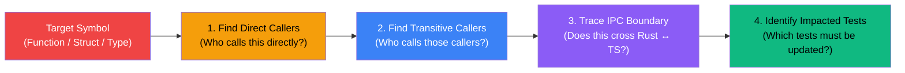

# Code Review Graph (CRG) & Impact Analysis

*Inspired by [code-review-graph](https://github.com/mizchi/code-review-graph) and [codegraph](https://github.com/colbymchenry/codegraph).*

> **The Blast Radius Rule**: *Never modify a public function, struct, or IPC command without mapping all upstream callers and downstream dependents first.*

---

## 🎯 When to Use This Skill

1. **Before modifying any signature** in `src-tauri/src/core/` (e.g., `derive_master_key`, `encrypt_record`, `VaultRecord`).
2. **Before changing any Tauri IPC command** in `commands/` or `lib/tauri.ts`.
3. **During code review / diff review** to calculate the **Blast Radius** of changed files.
4. **When diagnosing regressions** across the Rust $\leftrightarrow$ React IPC boundary.

---

## 🔍 The 4-Step Blast Radius Protocol



---

## 🛠️ Step 1: Upstream & Downstream Symbol Tracing

### Rust Backend Tracing

```bash
# 1. Find the symbol definition
grep_search: Query="pub fn function_name" SearchPath="src-tauri"

# 2. Find direct callers in Rust
grep_search: Query="function_name(" SearchPath="src-tauri"

# 3. Find type usages and struct instantiations
grep_search: Query="StructName" SearchPath="src-tauri"

# 4. Find affected unit & integration tests
grep_search: Query="test_.*function_name" SearchPath="src-tauri"
```

### Cross-Boundary Rust $\leftrightarrow$ TypeScript Tracing

When changing an IPC command (e.g., `cmd_unlock_vault`):

```
Rust Command Handler (`commands/vault_commands.rs`)
   └── Registered in `src-tauri/src/lib.rs` (tauri::generate_handler!)
   └── TypeScript Typed Wrapper (`src/lib/tauri.ts`)
   └── TypeScript Types (`src/lib/types.ts`)
   └── React Hooks (`src/hooks/useVault.ts`)
   └── UI Components (`src/components/screens/UnlockScreen.tsx`)
```

**Verification rule:** If a field changes in `core/models.rs`, you **must** update the mirrored interface in `src/lib/types.ts` in the exact same atomic commit.

---

## 📊 Blast Radius Severity Matrix

| Blast Radius | Scope | Required Action |
|:---|:---|:---|
| **Level 1: Leaf (Low)** | Private helper within single file | Run file unit tests; no cross-file impact. |
| **Level 2: Core Module (Medium)** | Public function in `core/` used by `commands/` | Update callers in `commands/`, run `cargo test`. |
| **Level 3: IPC Boundary (High)** | Tauri command or shared data model | Update Rust handler + `src/lib/types.ts` + `src/lib/tauri.ts` + React callers; run `cargo test` and `pnpm test`. |
| **Level 4: Crypto Invariant (Critical)** | KDF, AEAD, Key wrapping, or memory pinning | Security review audit + full round-trip tamper test suite + memory zeroize check. |

---

## 🛡️ Code Review Checklist (Graph-Guided)

Before approving or marking a change complete:

- [ ] **Node Reachability**: Are any callers orphaned or calling outdated signatures?
- [ ] **Type Parity**: Do Rust structs and TypeScript interfaces have identical field names and optionality?
- [ ] **Error Path Propagation**: Do all callers properly handle errors with `?` rather than `unwrap()`?
- [ ] **Test Coverage Completeness**: Did every node in the blast radius get verified by an automated test?
- [ ] **Zero Unintended Side Effects**: Did the change introduce memory leaks or bypass `Zeroize`?

---

## ⚡ Token-Saving Graph Tips (Anti-Context Bloat)

1. **Don't view whole files to find call sites**: Use `grep_search` with `MatchPerLine: true` to view only the specific line numbers where the symbol is invoked.
2. **Follow the dependency chain inward**: Start from the root data structure (e.g., `VaultKey`), trace to intermediate wrappers (`VaultHandle`), then to surface handlers (`commands/`).
3. **Use the local helper**: Run `./.agents/scripts/impact-analysis.sh <symbol_name>` to automatically map references before editing.
